# 第二章 信息的表示与处理

## 主要内容

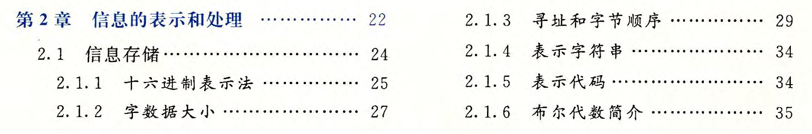 

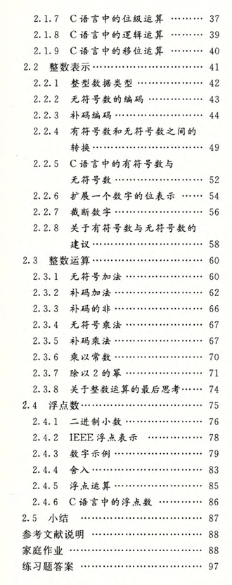 

------

## 笔记

现代计算机存储和处理的信息是以二值信号表示的，是基于二进制进行编码的，**好处在于：**

1. 比如我们可以将低电压表示0，将高电压表示1，如果电路中存在噪音或不完善的地方，只要不超过你设定的阈值，你就会得到一个清晰的信号；
2. 对于信息存储而言，存储一位信息或一个数字值比存储一个模拟值更容易。

当我们将若干个二进制数组合在一起，再加上某种解释，就能给这些二进制数赋予特定的含义，这个“解释”就是编码。比如对于文档中的字符和符号，我们可以使用标准的字符码将二进制数与字符和符号对应起来；对于数字表示，我们可以使用无符号编码来表示大于或等于零的数字，可以使用补码来表示有符号整数，可以使用浮点数编码来表示数字的科学计数法。

- 模运算相当于忽略某些位的值，比如计算`x mod 8`，则只保留x低三位的值。
- 比较有符号数和无符号数之间的大小，先将其转化为二进制编码，再根据特定编码计算比较。
- 所有性质都可以直接通过二进制以及对应的编码去解释，首先考虑二进制的值是什么。
- 补码和无符号数对应的位向量，在计算结果上都是相同的，大部分计算机中使用相同的机器指令进行计算，所以可以先将补码转换为无符号数进行推导，再转为补码会更容易。
- 加法逆元的求法就是通过溢出实现的，比如求x的加法逆元，直接计算~x+1，就能保证有效位里都是0。
- 尽量不使用无符号数。

### 信息存储

1. 计算机将 8 个`bit`当做一个块，称为**字节（Byte）**，作为可寻址的最小内存单位。而操作系统给每个进程提供了虚拟内存的抽象，让进程都能访问从相同地址开始的、连续的虚拟内存空间，每个内存单位都有**唯一的编码**进行标识，这个编码称为**地址（Address）**，而所有地址的集合就构成了虚拟内存空间。

2. 那每个虚拟内存空间最大能有多大呢？这主要取决于计算机的一个参数——**字长（Word Size）**，我们可以将若干个字节当做一个块，称为**字（Word）**，而这里的字节的数目就是字长。字长指明了指针数据的**标称大小（Nominal Size）**，而指针指向虚拟内存空间，它的位数就决定了它能索引多大的空间，由此也就规定了虚拟内存空间的最大大小。所以虚拟空间的最大大小由字长决定。

3. 内存是一系列字节，我们可以根据字长将其划分成不同的**字（Word）**，每个字的地址是该字中最低位的地址。**主要思想**是，我们可以把任意多的字节组合起来称之为一个字。

4. 计算机系统的一个基本概念就是，从机器的角度来看，程序仅仅只是字节序列。机器没有关于原始源程序的任何信息，除了可能有些用来帮助调试的辅助表以外。

5. 位级运算：
   C中的整型数据类型是使用二进制数进行编码的，二进制数可以对应为布尔代数的位向量，所以它可以支持按位的布尔运算，比如`|`表示OR、`&`表示AND、`~`表示NOT、`^`表示XOR（异或）。

   其次，位级运算的一个常见用法就是实现**掩码运算**。这里的掩码就是一个位模式，表示从一个字中选出的为的集合。比如提取最低有效字节`x&0xFF`，保留除了最低有效字节以外的字节`x&~0xFF`。

   > 布尔代数的`&`对`|`具有分配律，而`|`对`&`也具有分配律。元素与自身异或会得到0。0异或任意元素保持不变。与全F取异或是取反。

6. 逻辑运算：

   C提供了一组逻辑运算符`||`、`&&`和`!`分别对应于命题逻辑中的`OR`、`AND`和`NOT`运算。要注意逻辑运算和位级运算的区别，在逻辑运算中，**只要是非零的数据就表示为`TRUE`**，全零的数据就表示为`FALSE`，所以计算时候先将其转换为`TRUE`和`FALSE`，然后计算出来的结果只会是`0x00`或`0x01`，分别对应`FALSE`和`TRUE`。

   逻辑运算中有一个特点：**提早终止（Early Termination）**。当计算逻辑与和逻辑或时，如果只通过左侧的式子就已经能得到最终的结果，就不会再计算右侧的式子了。比如

7. 移位运算：

   C语言表示的二进制编码，可以对其进行移位操作。x向左移k位，表示为`x<<k`，此时会丢弃最高的k位，并在右侧补充k个零。x向右移k位，表示为`x>>k`，由于整型编码的问题，会将右移操作分为逻辑右移和算数右移，逻辑右移就是丢弃最低的k位，并在左侧补充k个零，而算数右移中，因为有符号数使用最高位来表示数字的正负性，为了保证数字的正负性不变，就丢弃最低的k位，并在左侧补充最高有效位的值。

   C语言没有对何时使用逻辑右移和算数右移进行规定，但是一般编译器/及其组合都对有符号数使用算数右移， 而对于无符号数，就使用逻辑右移。

### 整数表示

 

可以发现，有符号数的取值范围是不对称的，负数的范围比正数范围大1。

1. 有符号数的编码：

   有符号数有很多不同的编码方式，比如**补码**、**反码**和**原码**。其中最常见的是补码编码，C语言标准没有要求要用何种形式的编码来表示有符号整数，但是几乎所有机器都会使用补码编码。

   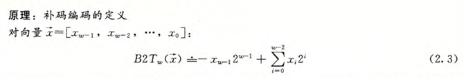 

   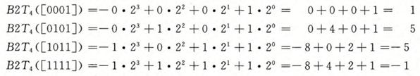 

2. 补码编码的范围是不对称的，
   $$
   |TMax_w|+1=|TMin_w|
   $$
    这是因为通过设置符号位，将一半的位模式表示为负数，将另一半的位模式表示为非负数，而0是非负数，所以负数就比正数多1个。所以**测试时要特别小心 。**

    

   第二，最大的无符号数值刚好比补码的最大值的两倍大一点。补码表示中所有表示负数的位模式在无符号表示中都变成了正数。
   $$
   UMax_w=2TMax_w+1
   $$

3. 有符号数和无符号数之间的转换：

   C语言可以在各种不同的数字类型之间做强制类型转换，它的具体实现要从位级角度来看，它保持位值不变，只是改变了解释这些位的方式。在C语言中，当一个有符号数和一个无符号数进行计算时，会**隐式地将有符号数转化为无符号数**。当进行逻辑判断时，可能会出现问题

   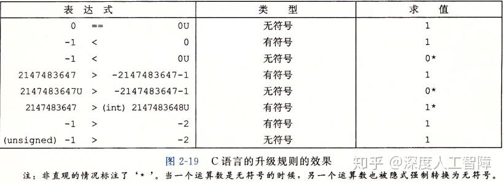 

   由于有符号数到无符号数的隐式转换，可能会导致错误或漏洞，因此建议**绝不使用无符号数**。但是如果我们想把字看成是位的集合，而没有实际意义，则无符号数非常有用。

4. 扩展位：**保持数值不变地增加位宽**

   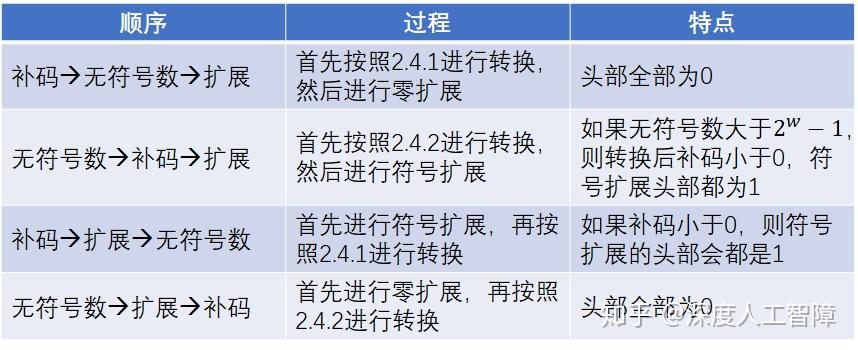 

5. 截断位

   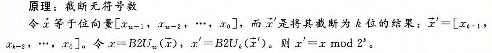 

   对 **2 的 w'次方 **取模就相当于丢弃w'之前的位。

### 整数运算

1. 无符号数加法

   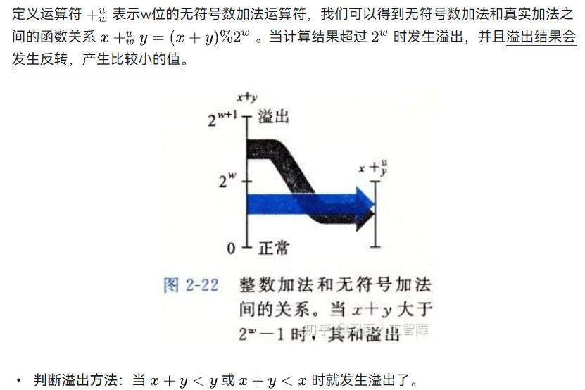 

2. 补码加法

   使用补码的一个**优势在于**：补码加法可以使用和无符号数加法相同的硬件，相同的算法，就得到到有符号数的加法。所以大多数计算机用相同的机器指令来执行补码和无符号数加法。

   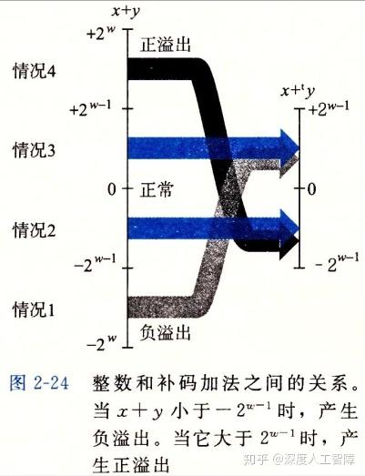 

   **判断溢出方法：**当x>0, y>0，计算结果小于等于0时，发生了正溢出；当x<0, y<0，计算结果大于等于0时，发生了负溢出。

   **加法逆元：**也是利用溢出的原理来计算补码的加法逆元。**注意：**部分补码的加法逆元和数学上的相反数是相同的。

3. 无符号乘法

   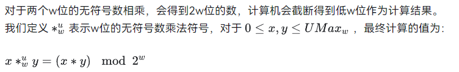 

4. 补码乘法

    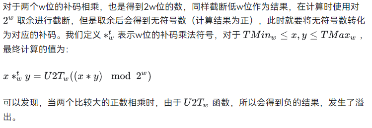 

5. 实现乘除法

   计算机中支持各种整数运算，比如加法、减法、位级运算和移位。而大多数机器中，整数乘法指令和整数除法指令都很慢，通常需要几十个时钟周期，所以计算机通常会用移位和加减法的组合来代替乘除法。**首先我们讨论乘上 2 幂的特殊情况，然后将其扩展到乘上任意数。**

   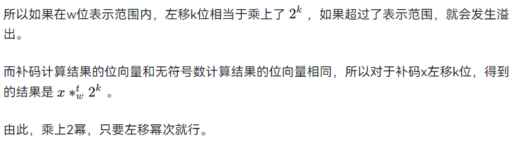 

   乘上任意数：

   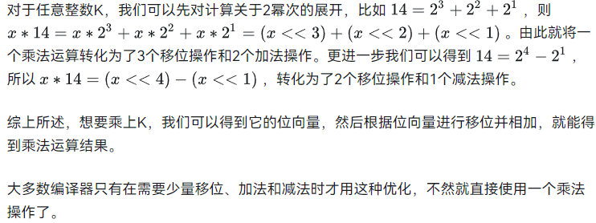 

6. 与乘法相同，我们可以通过右移操作来除以 2 的幂。对于无符号数，我们使用逻辑右移来除以 2 的幂，而对于补码，我们要用算术右移来保持符号不变。

    在除法运算中，比较麻烦的是出现除不尽的情况，此时就需要舍入，我们希望计算结果都是向 0 舍入的。

    但是 **当补码小于0时，结果是远离0进行取整的，不符合预期。**所以对于补码的算术右移，我们需要先加上一个偏移量，使其满足向 0 舍入的预期。

    注意：**除法无法像乘法那样对任意数进行扩展。**原因：除法结果是浮点数或需要舍入的整数，移位只能实现除以 2 的幂（如`x >> 3`是`x / 8`）。非 2 的幂除法需要复杂的乘倒数+修正，无法像乘法那样简单组合移位。

### 浮点数

1. 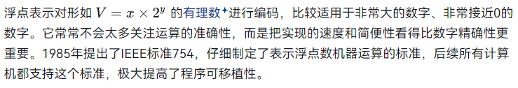 

2. IEEE浮点表示

    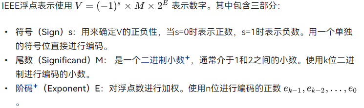 

    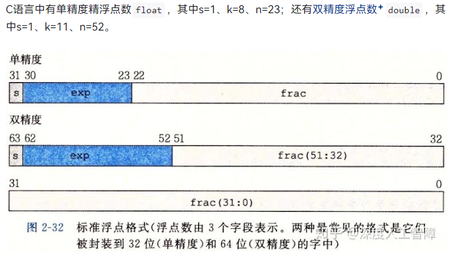 

    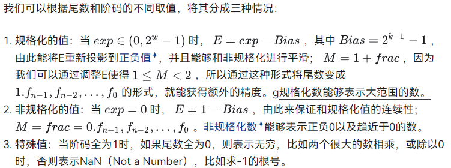 

    通过上面我们可以观察到几个**现象**：

    - 非规格数稠密地分布在靠近 0 的区域；
    - 有些数的间隔是等距的，因为当`exp`值不变，在`frac`尾数区域进行增加会乘上相同的指数；
    - 越大的数间隔越大，因为比较大的数，它的指数会比较大，使得每次变化量会比较大。

3. 计算数值

    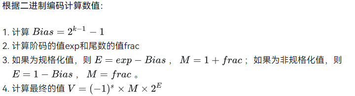 

    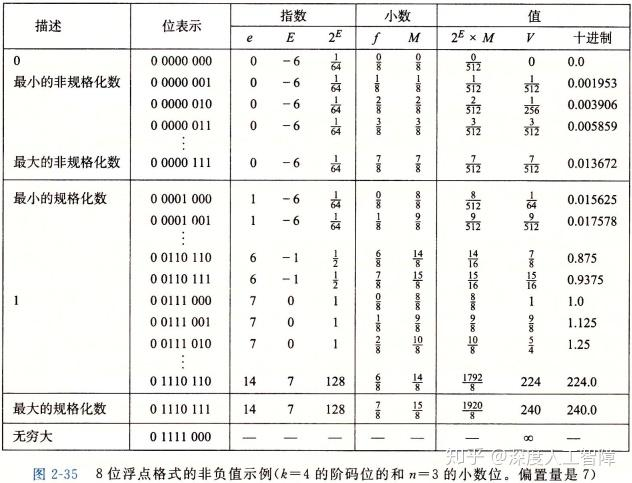 

    好处：

    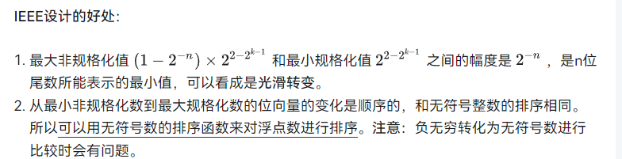 

    示例：

    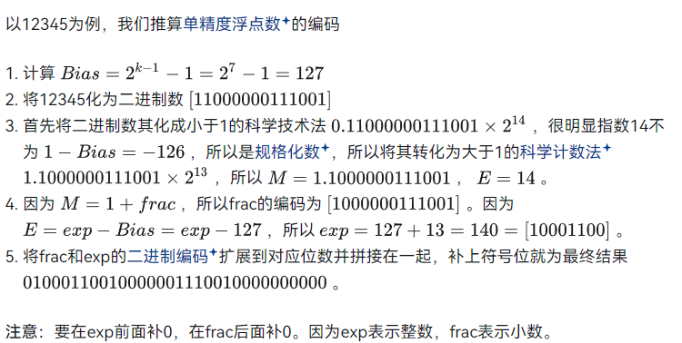 

    **对比无符号数的编码，我们可以发现：**因为无符号数一定大于 0，所以相同的数想用浮点数编码只能使用规范化数进行编码，而规范化数会将`frac`的最高有效位 1 去掉，所以无符号数的编码和浮点数编码，在`frac`部分是相似的，浮点数会少了最高有效位的 1。而无符号数的其他部分就是 0，而浮点数的其他部分是表示指数的编码。

4. 浮点数舍入

    浮点数由于有限的位数，所以对于真实值`x`，我们想要用一种系统的方法来找到能够用浮点数表示的“最接近的`x`”匹配值`x'`，这个过程就称为**舍入**。

    常见的舍入方法有四种：向零舍入、向上舍入)、向下舍入以及向偶数舍入。

5. 浮点数运算

    浮点数运算无法直接通过在位向量上运算得到。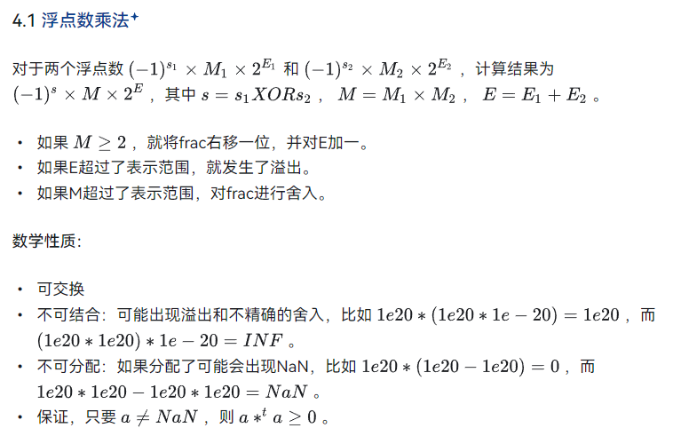 

    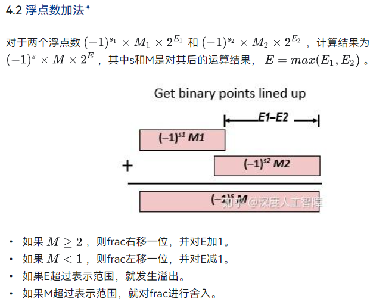 

    **注意：**需要考虑好清楚数值的范围，如果计算的数值范围变化很大，需要重新结合或改变运算顺序，避免由于溢出或舍入出现计算问题。

6. C中的浮点数

    C中提供了`float`和`double`两种精度的浮点数。由于编码不同，所以在浮点数和整型数之间强制类型转换时，会修改编码，并且会出现溢出和舍入。         

    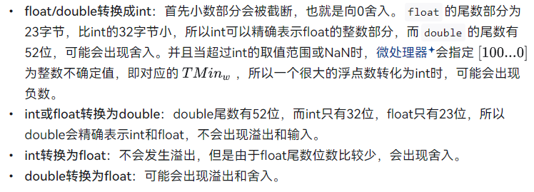     

    **总结：**超过数值表示范围，会发生溢出；尾数较短，会发生输入。

7. 小结：

    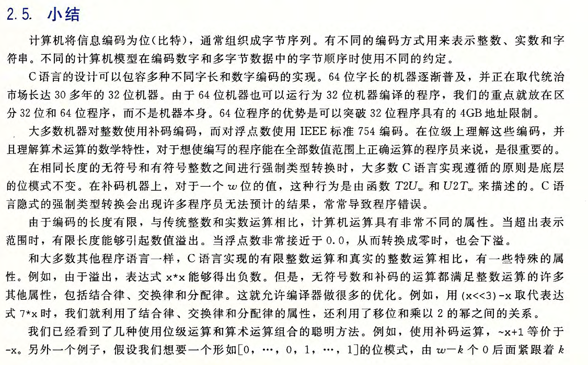 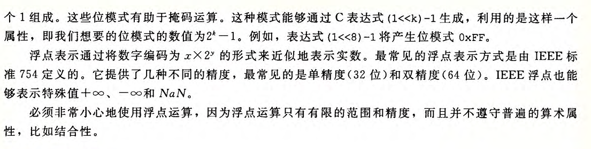                               

