# 第三章 数据

## 此章主要内容

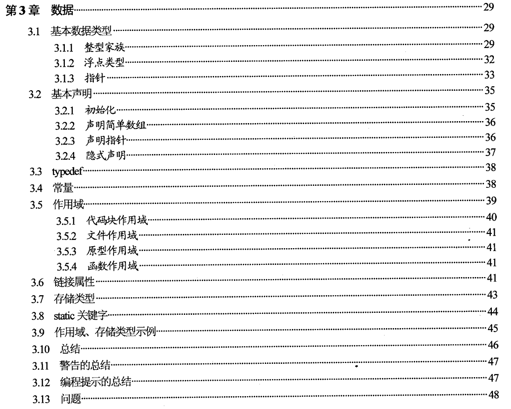 

------

## 随笔笔记

1. C语言中，仅有四种数据类型：整型，浮点型，指针，聚合类型（数组，结构体）。

   `char`字符类型、`short`短整型、`int`整形、`long`长整形。

   均有两个版本：`signed`有符号，`unsigned`无符号。

   **变量的最小范围**

   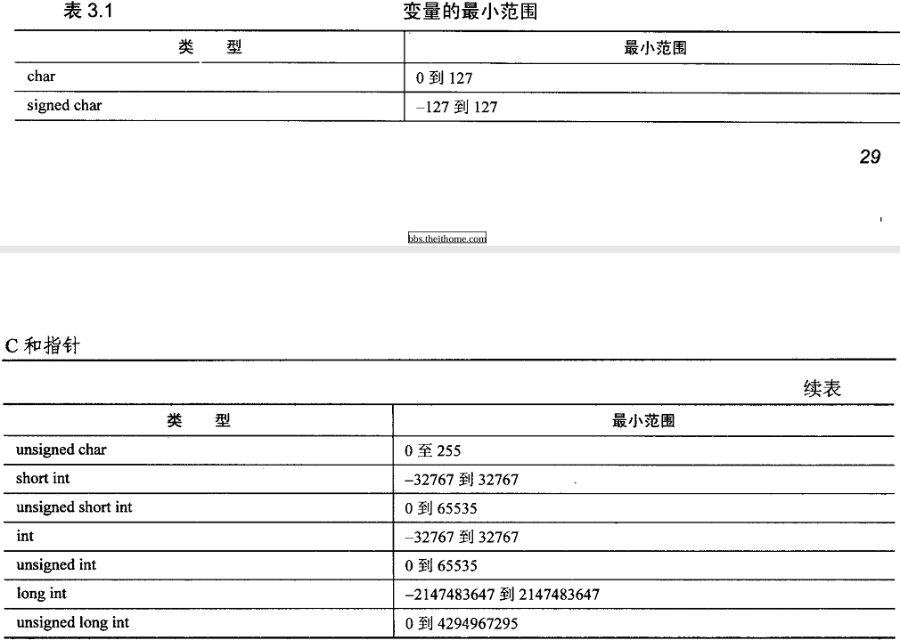 

2. 枚举类型

   枚举类型用的相当少。`enum`关键字来定义一个常量集合。枚举类型的实际值是整型值，故枚举类型的`sizeof`都是 4。
   枚举类型常量从 0 开始自增加 1。也可以在定义时候进行初始化。
   枚举类型是预处理指令`#define`的代替。指它的值为符号常量而不是字面值的类型。

3. **指针只是地址的另一个名字罢了。**

   **一个需要注意的地方：**

   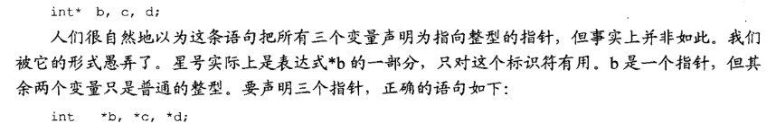 

4. `typedef`

   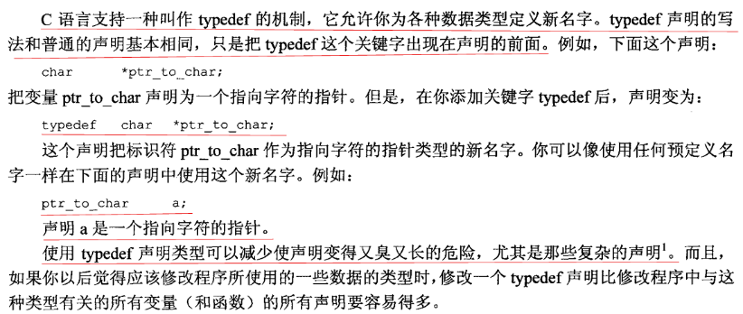 

5. **寄存器变量** 比存储于内存的变量访问起来效率更高，往往放置变量。

6. 作用域

   - 编译器可以确认 4 种不同类型的作用域：**文件作用域、函数作用域、代码块作用域、原型作用域。**以前确实没有注意这些名词。
   - 一对大括号就是一个代码块。在其内部声明的变量的作用域即为代码块作用域。显然，可能会有作用域重叠，变量名相同的问题。这里采用的是就近原则，重名覆盖。
   - 函数形参变量的作用域已经被扩展到了整个函数体中。即在函数最外层的局部变量其不允许同名形参的变量。
   - 至于 **原型作用域**，只适用于函数原型中声明的参数名。在`C`语言中貌似还不能只写参数类型，忽略参数名。在`cpp`中支持该点。只要形参名不重复，在原型作用域下就没啥问题了。

7. 链接属性

   在多个源文件进行编译的时候，若产生相同变量名。怎么办呢？到底都指的是同一个实体还是不同实体呢？**标识符的链接属性** 专门来处理该问题。标识符的作用域与它的链接属性有关。

   三种链接属性：`external`（外部）、`internal`（内部）、`none`（无）。这里的 **缺省** 就是 **默认**。

   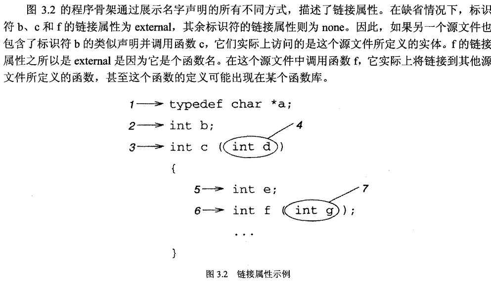 

   至于`static`和`extern`这两个关键字，都可用于修改标识符的链接属性。详见：

   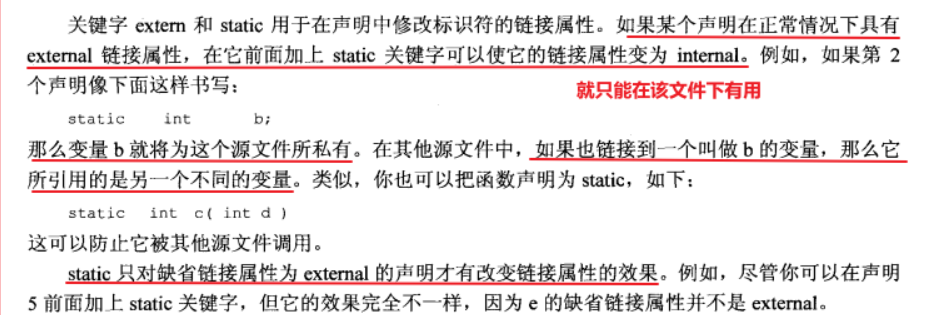 

8. `static`关键字

   `static`存储类指示编译器在程序的生命周期内保持局部变量的存在，而不需要在每次它进入和离开作用域时进行创建和销毁。因此，使用`static`修饰局部变量可以在 **函数调用之间保持局部变量的值。**

   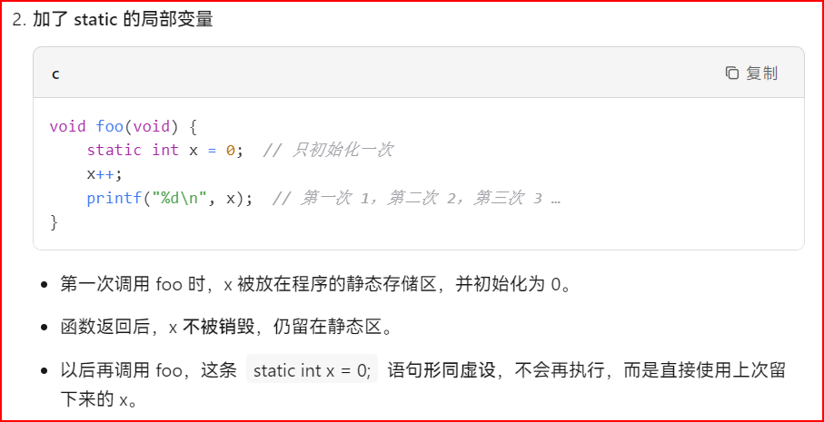 

   `static`修饰符也可以应用于全局变量。当`static`修饰全局变量时，会使变量的作用域 **限制在声明它的文件内。**

   `static`是全局变量的默认存储类。

   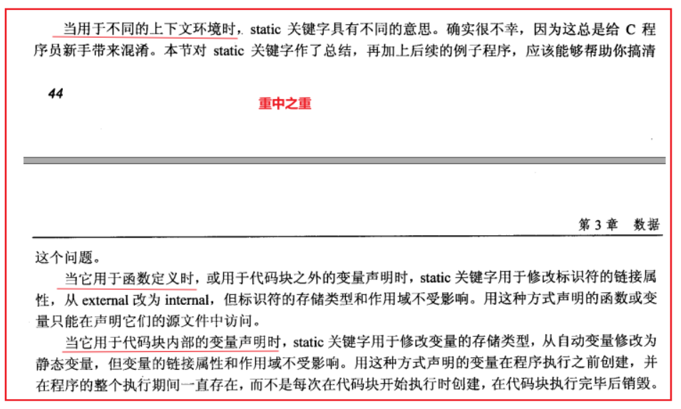 

9. `extern`关键字

   `extern`存储类用于提供一个全局变量的引用，全局变量对所有的程序文件都是可见的。当您使用`extern`时，对于无法初始化的变量，会把变量名指向一个之前定义过的存储位置。

   当您有多个文件且定义了一个可以在其他文件中使用的全局变量或函数时，可以在其他文件中使用`extern`来得到已定义的变量或函数的引用。可以这么理解，`extern`是用来在 **另一个文件中声明一个全局变量或函数。**

   `extern`修饰符通常用于当有两个或多个文件共享相同的全局变量或函数的时候

10. 存储类型

    - `C`语言中提供了存储说明符`auto，register，extern，static`说明的四种存储类别。四种存储类别说明符有两种存储期：**自动存储期** 和 **静态存储期**。其中`auto`和`register`对应自动存储期。具有自动存储期的变量在进入声明该变量的程序块是被建立，它在该程序块活动时存在，退出该程序块时撤销。

    - 三个地方可以用于存储变量：普通内存、运行堆栈、寄存器。代码块外定义的变量都存在静态内存中，称为 **静态变量。** 初始化为 0。

    - `auto`关键字修饰的变量称为 **自动变量**，这个不同于`C++`的`auto`关键字用法啊。缺省的变量类型可以拿`auto`修饰，但它并不具备变量类型推导的功能，只是将该变量类型填充为`int`。

    - `static`关键字可以延长局部变量的生命周期，使该变量的存储类型从自动变为静态。但并不改变该变量的作用域。**函数的形参不可以被声明为静态**，因为实参总是在堆栈中传给函数，用于支持递归。

    - `register`关键字大多都是寄存器优化啥的，这个编译器有自己的想法不用太在意。或许真的很注重性能，可以使用该关键字进行修饰变量。

      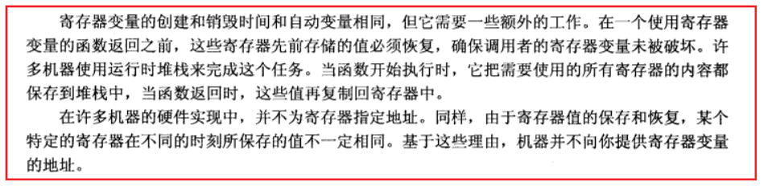 

11. 初始化

    静态变量及全局变量若不显式初始化，则会默认初始化为 0。局部变量及自动变量若不在定义的时候初始化，那么里面存的值就是垃圾。

    显式初始化其实是插入了一条隐式的赋值语句。效率都是一样的。

12. 作用域、存储类型**示例**

    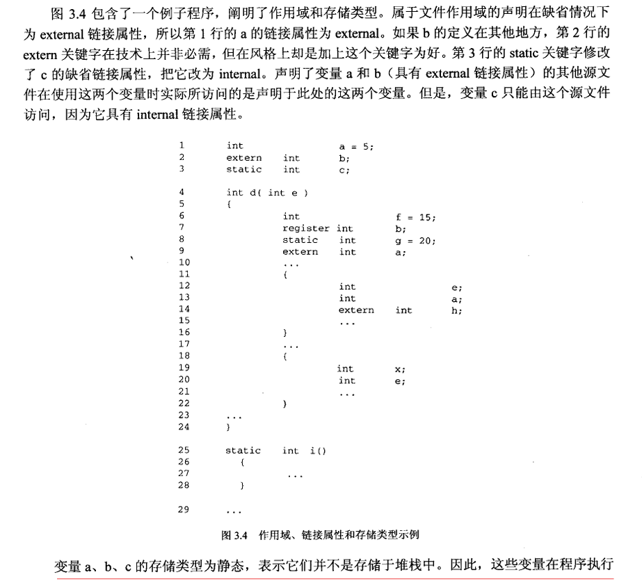 

    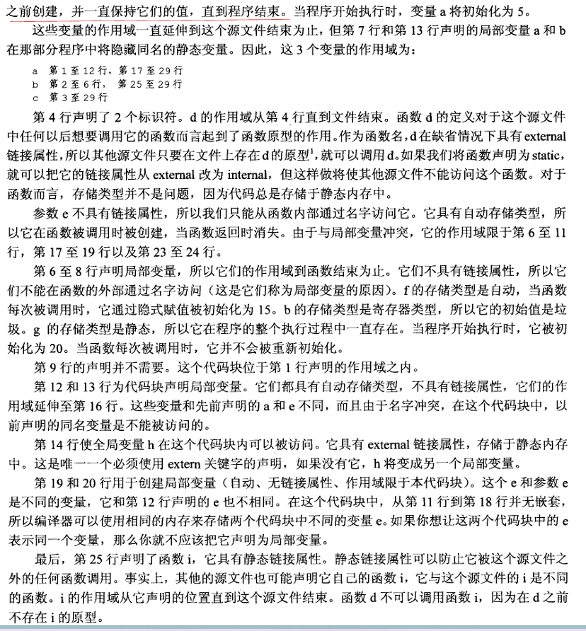 

    问了下AI：静态变量储存在哪里？

    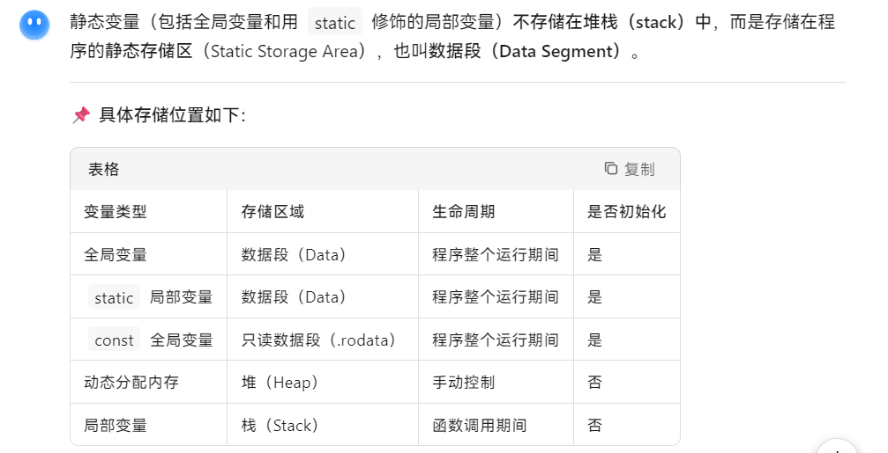 

------

## 本章习题

1. 在你的机器上，字符的范围有多大？有哪些不同的整数类型？它们的范围又是如何？

   答：见`question1.cpp`，直接去查看`<limits.h>`中到底是怎样定义的。

2. 在你的机器上，各种不同类型的浮点数的范围是怎样的？

   答：直接找`float.h`。

3. 假定你正编写一个程序，它必须运行于两台机器之上。这两台机器的缺省整型长度并不相同，一个是 16 位，另一个是 32 位。而这两台机器的长整型长度分别是 32 位和 64 位。程序所使用的有些变量的值并不太大，足以保存于任何一台机器的缺省整型变量中，但有些变量的值却较大，必须是 32 位的整型变量才能容纳它。一种可行的解决方案是用长整型表示所有的值，但在 16 位机器上，对于那些用16位足以容纳的值而言，时间和空间的浪费不可小视。在 32 位机器上，也存在时间和空间的浪费问题。

   如果想让这些变量在任何一台机器上的长度都合适的话，你该如何声明它们呢？正确的方法是不应该在任何一台机器中编译程序前对程序进行修改。提示：试试包含一个头文件，里面包含每台机器特定的声明。

   答：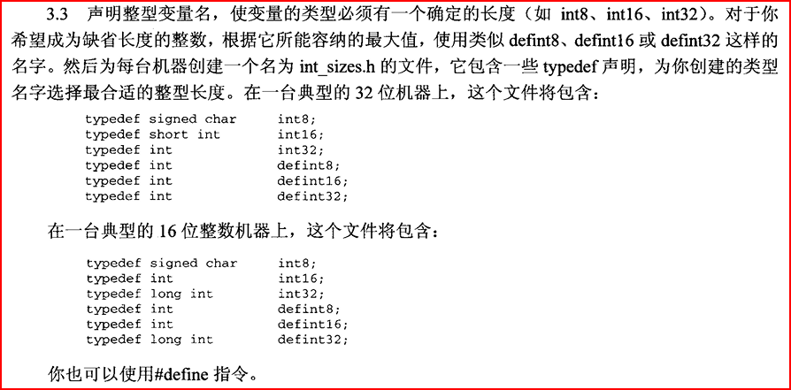 

4. 假定你有一个程序，它把一个`long`整型变量赋值给一个`short`整型变量。当你编译程序时会发生什么情况？当你运行程序时会发生什么情况？你认为其他编译器的结果是否也是如此？

   答：`warning`警告。只要能放下也无所谓。否则，根据各个编译器自己的规矩来，可能溢出，可能直接丢弃高阶位，这些情况都是有可能的。

5. 假定你有一个程序，它把一个`double`变量赋值给一个`float`变量。当你编译程序时会发生什么情况？当你运行程序时会发生什么情况？

   答：编译时多半只报警告；运行时发生一次隐式强制转换，可能损失精度甚至溢出，但程序不会崩溃（除非值变成`NaN/inf`后后续计算出错）。

6. 编写一个枚举声明，用于定义硬币的值。请使用符号`PENNY、NICKEL`。

   答：`enum Change { PENNY = 1, NICKEL = 5, DIME = 10, QUARTER = 25, HALF_DOLLAR = 50, DOLLAR = 100 };`

7. 下列代码段会打印出什么东西？

   ```
   enum Liquid { OUNCE = 1, CUP = 8, PINT = 16, QUART = 32, GALLON = 128 };
       enum Liquid jar;
       ...
       jar = QUART;
       printf("%s\n", jar);  
       jar = jar + PINT;
       printf("%s\n", jar);  
   ```

   答：不确定。枚举类型是拿整形来存储的，但是这里是`%s`格式化字符串打印，则输出是不确定的。如果是`%d`则输出`32 48`。

8. 你所使用的C编译器是否允许程序修改字符串常量？是否存在编译器选项，允许或禁止你修改字符串常量？

   答：不允许。`vs2019`应该可以看，`vscode`还没摸索这个问题。

9. 如果整数类型在正常情况下是有符号类型，那么`signed`关键字的目的何在呢？

   答：适用于字符类型。显示定义字符变量，保证一致性。

10. 一个无符号变量可不可以比相同长度的有符号变量容纳更大的值？

    答：可以。同长度下，无符号最大值 ≈ 有符号最大值的两倍。

11. 假如`int`和`float`类型都是 32 位长，你觉得哪种类型所能容纳的值精度更大一些？

    答：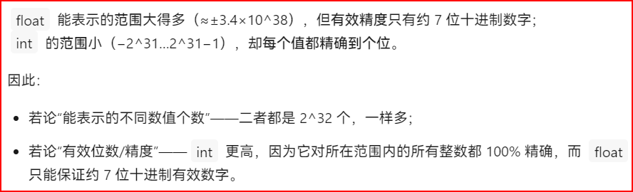 

12. 下面是两个代码片段，取自一个函数的起始部分。

    ```
    int a = 25;
    
    int a;
    a = 25;
    ```

    它们完成任务的方式有何不同？

    答：没啥不同。显示初始化就是将两个合到一起罢了，在定义的时候隐式的插入了一条赋值语句而已。

13. 如果问题 12 中代码片段的声明中包含有`const`关键字，它们完成任务的方式又有何不同？

    答：左边仍旧可以。右边错误，不能该一个常量赋值。

14. 在一个代码块内部声明的变量可以从该代码块的任何位置根据名字来访问，对还是错？

    答：错。若嵌套代码块中包含了同名变量，那么外层同名变量将被隐藏。

15. 假定函数`a`声明了一个自动整型变量`x`，你可以在其他函数内访问变量`x`，只要你
    使用了下面这样的声明：

    ```
    extern int x;
    ```

    对还是错?

    答：错。代码块中的局部变量永远不能 **从其它代码块中按名称直接访问**。

16. 假定问题 15 中的变量`x`被声明为`static`。你的答案会不会有所变化？

    答：错。`static`延长所修饰变量的生命周期，更改其存储类，但并不会更改其作用域。

17. 假定文件`a.c`的开始部分有下面这样的声明:

    ```
    int x;
    ```

    如果你希望从同一个源文件后面出现的函数中访问这个变量，需不需要添加额外的声明，如果需要的话，应该添加什么样的声明？

    答：这就是全局变量。不需要做任何操作。

18. 假定问题 17 中的声明包含了关键字`static`。你的答案会不会有所变化？

    答：不会。仍然有内部链接。本文件后的所有函数均可以访问。

19. 假定文件`a.c`的开始部分有下面这样的声明：

    ```
    int x;
    ```

    如果你希望从不同的源文件的函数中访问这个变量，需不需要添加额外的声明，如果需要的话，应该添加什么样的声明？

    答：`extern int x;`

20. 假定问题 19 中的声明包含了关键字`static`。你的答案会不会有所变化？

    答：会。`static`和 `extern`两者就是矛盾的。 `static`修饰本文件内的变量，在函数中的是静态变量。而`extern`表示的是其他文件定义的变量，显然两者是矛盾的。且单单用`static`来声明，却想获取其他文件的全局变量是不可能的。

21. 假定一个函数包含了一个自动变量，这个函数在同一行中被调用了两次。试问，在函数第 2 次调用开始时该变量的值和函数第 1 次调用即将结束时的值有无可能相同？

    答：可能相同。函数内自动变量在堆栈中用完即销毁。第二次调用可能仍分配同样地址造成结果相同。但是堆栈信息被破坏时，这些变量的信息也将被破坏。只是巧合而已。

22. 当下面的声明出现于某个代码块内部和出现于任何代码块外部时，它们在行为上有何不同？

    ```
    int a =5;
    ```

    答：内部：自动变量，每次调用函数都将被重新初始化，作用域仅在该函数内部，无连接。外部：静态变量，只初始化一次，在程序开始之前，具有文件范围和外部链接。

23. 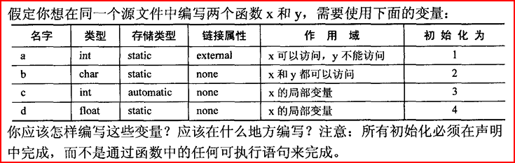 

    答：

    ```
    #include <stdio.h>
    
    static char b = 2;
    
    void y() {
    
    }
    
    int a = 1;
    
    void x() {
        int c = 3;
        static float d = 4;
    }
    ```

24. 确认下面程序中存在的任何错误（你可能想动手编译一下，这样能够踏实一些）。在去除所有错误之后，确定所有标识符的存储类型、作用域和链接属性。每个变量的初始值会是什么？程序中存在许多同名的标识符，它们所代表的是相同的变量还是不同的变量？程序中的每个函数从哪个位置起可以被调用？

    ```
    static int w = 5;
    extern int x;
    static float
    func1(int a, int b, int c)
    {
        int c, d, e = 1;
        ...
        {
            int d, e, w;
            ...
            {
                int b, c, d;
                static int y = 2;
                ...
            }
        }
        {
            register int a, d, x;
            extern int y;
            ...
        }
    }
    static int y;
    float
    func2(int a)
    {
        extern int y;
        static int z;
        ...
    }
    ```

    答：有一个错误：第 6 行中`c`的声明与函数声明参数`c`冲突，编译器将第 24 行标记为错误，称其与中的声明冲突第 20 行。这不应该是一个错误，因为第 20 行中`y`的范围在第 22 行用完了，因此不是冲突。


 