# 第四章 语句

## 本章主要内容

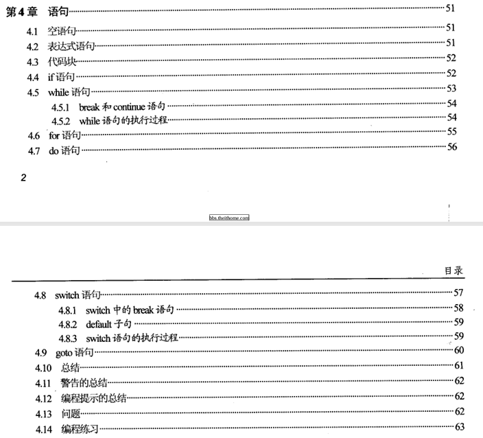 

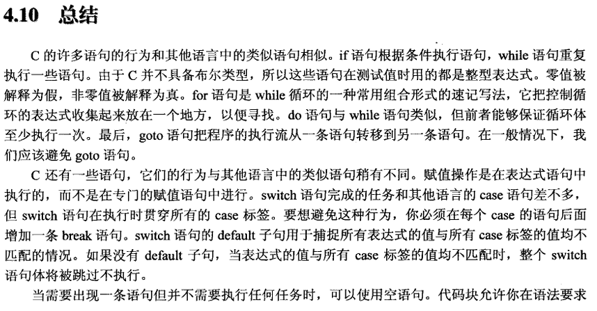 

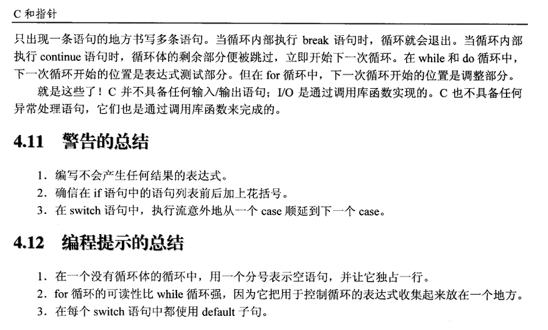 

------

## 随笔笔记

1. C语言中并没有专门的“赋值语句”，所以用表达式来表示

   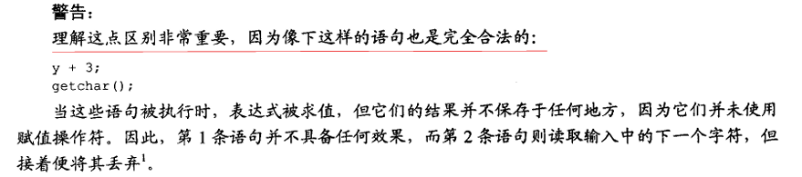 

2. 没啥好记的

## 课后习题解答

1. 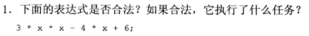 

   答：合法。可以正确执行，但是对程序不造成任何影响。这些操作符均不具有副作用，计算结果没有赋给任何变量。

2. 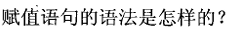 

   答：事实上`C`没有 **赋值语句**。赋值是用赋值运算符表达式语句完成的。如`a = b + c;`

3. 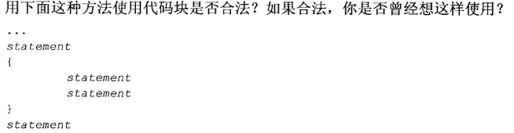 

   答：合法，确实没这样用过。代码块中定义局部变量，可将这些变量的访问及生存周期限制在本代码块中。想来也是一个很不错的操作！

4. 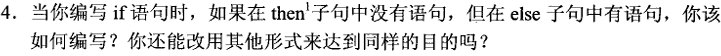 

   ```
   #include <stdio.h>
   
   int main() {
       int flag = 0;
       // 空语句写法
       if (flag)
           ;
       else
           puts("hello");
   
       // 等价写法
       if (!flag)
           puts("hello");
   
       return 0;
   }
   ```

5. 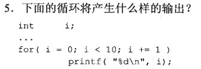 

   答：输出`0~9`之间的整数。

6. 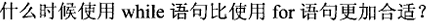 

   答：在没有初始化或者调整表达式的时候，即`for`循环的第一部分、第三部分。此时，相较于`for`循环来讲，`while`更加方便。

7. 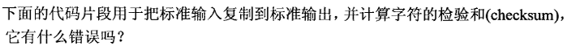 

   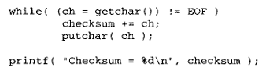 

   答：忘记加`{ }`，中间字符不打印，只会打印`EOF`和校验和。然而`EOF`这个字符是无效的。

8. 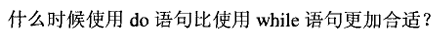 

   答：当循环体必须执行一次的时候。

9. 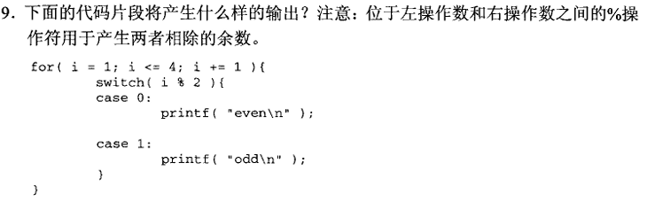 

   答：不存在`break`语句，继续执行`case1`。

10. 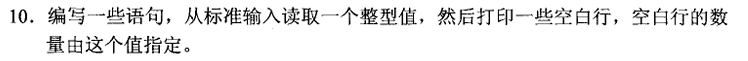 

    ```
    #include <stdio.h>
    
    int main() {
        int n;
        scanf("%d", &n);
        for (int i = 0; i < n; ++i)
            puts("");
        return 0;
    }
    ```

11. 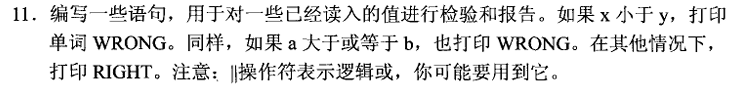 

    ```
    #include <stdio.h>
    
    int main() {
        int x, y, a, b;
        scanf("%d%d%d%d", &x, &y, &a, &b);
        
        if (x < y || a >= b)
            puts("WRONG");
        else
            puts("RIGHT");
    
        return 0;
    }
    ```

12. 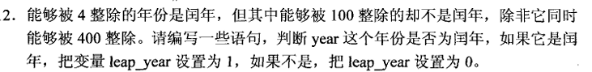 

    ```
    #include <stdio.h>
    
    int main() {
        int year;
        scanf("%d", &year);
    
        int leap_year = 0;
        if (((year % 4 == 0) && (year % 100 != 0)) || (year % 400 == 0))
            leap_year = 1;
        else
            leap_year = 0;
    
        printf("%d\n", leap_year);
        return 0;
    }
    ```

13. 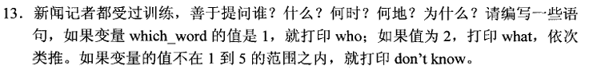 

    ```
    #include <stdio.h>
    
    int main() {
        int which_word;
        scanf("%d", &which_word);
    
        switch (which_word) {
        case 1:
            puts("who");
            break;
        case 2:
            puts("what");
            break;
        case 3:
            puts("when");
            break;
        case 4:
            puts("where");
            break;
        case 5:
            puts("why");
            break;
        default:
            puts("don't know");
            break;
        }
        return 0;
    }
    ```

14. 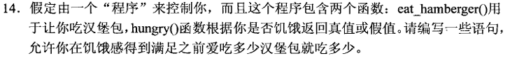 

15. 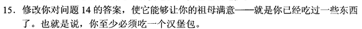 

    ```
    #include <stdio.h>
    
    int main() {
        while (hungry())
            eat_hamburger();
    
        do {
            eat_hamburger();
        } while (hungry());
    
        return 0;
    }
    ```

16. 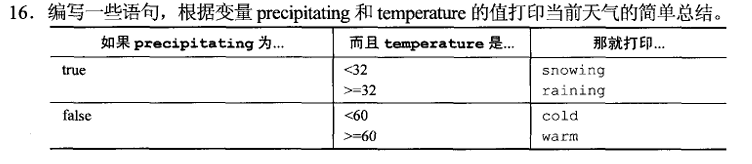 

    ```
    #include <stdio.h>
    
    int main() {
        int precipitating, temperature;
        scanf("%d%d", &precipitating, &temperature);
    
        if (precipitating) {
            if (temperature < 32)
                puts("snowing");
            else
                puts("raining");
        } else {
            if (temperature < 60)
                puts("cold");
            else
                puts("warm");
        }
        return 0;
    }
    ```

## 写程序

1. 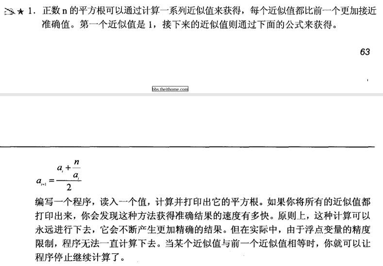 

   ```
   #include <stdio.h>
   
   const double eps = 1e-6;
   
   int main() {
       double x;
       scanf("%lf", &x);
   
       if (x < 0)
           puts("error");
   
       double new = 1, last;
       do {
           last = new;
           new = (last + x / last) / 2;
           printf("%.4lf\n", new);
       } while (last - new <= eps);
   
       return 0;
   }
   ```

2. 


