# 第五章 操作符和表达式

------

## 本章主要内容

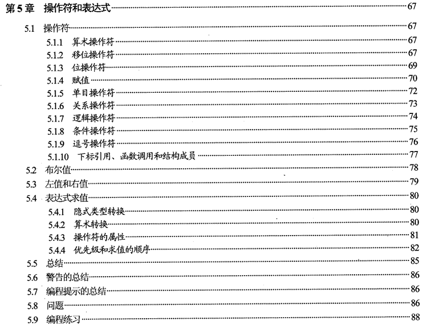 

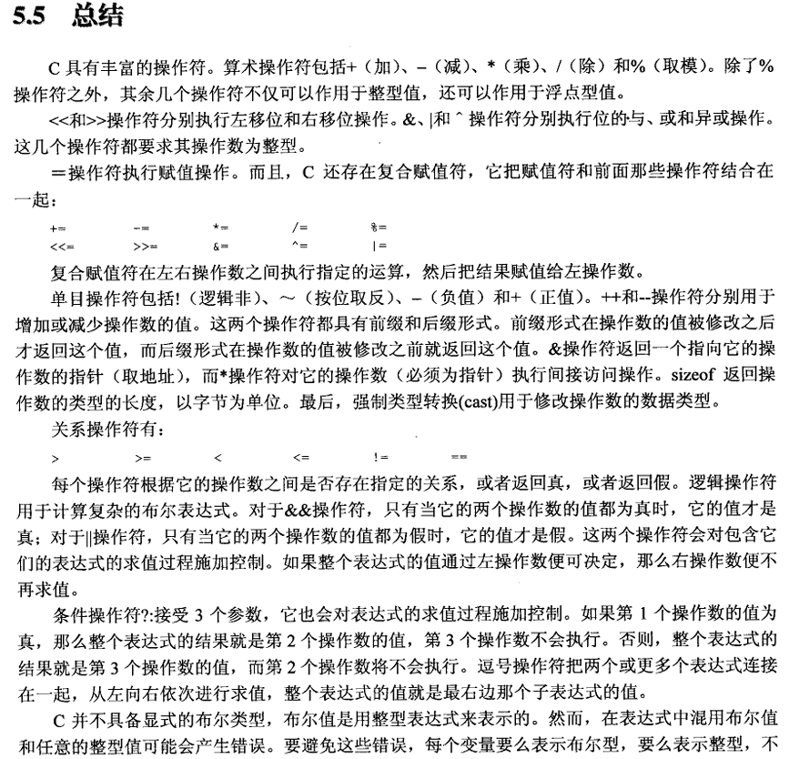 

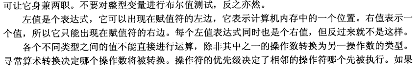 

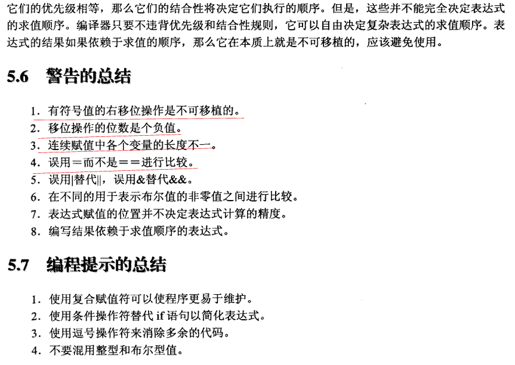 

------

## 笔记

1.  C语言中 **整形提升**、**隐式类型转换** 等操作会给报出五花八门的错误。这点在编程实践中会经常遇见。

2. 关于字符型计算过程中转整形

   这个就涉及C语言的隐式类型转换。字符型在计算过程中会被隐式转成整形进行计算，再赋值给字符型变量时，若溢出，则截断处理。

3. 关于左值和右值

   不知道在哪听过这样一个结论来区分左值和右值：**能取地址的就是左值，不能取地址的就是右值。**

------

## 课后习题答案

1. 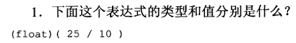 

   答：值为 2.0，类型`float`

2. 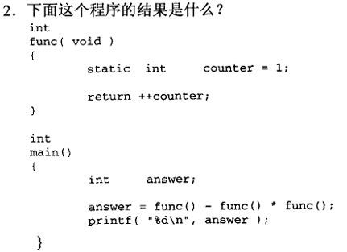 

    答：

   ```
   #include <stdio.h>
   
   int func ( void )
   {
       static int counter = 1;
       return ++counter;
   }
   
   int main ()
   {
       int answer; 
       answer = func() - func() * func();
       printf( "%d\n", answer );
   
       return 0;
   }
   
   输出-10
   ```

3. 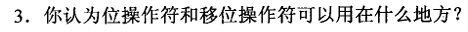 

   答：它们通常用于对设备控制器进行编程，以设置或测试特定的位位置。

4. 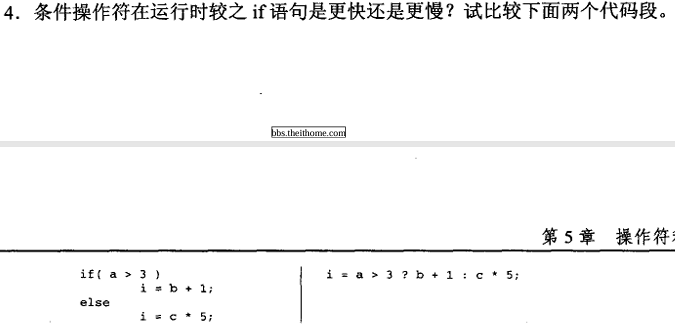

   答：速度相当。

5. 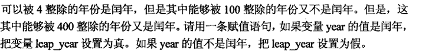

   答：

   ```
   if ((year % 4 == 0 && year % 100 != 0) || (year % 400 == 0));
   ```

6. 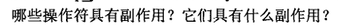 

   答：

   | 运算符类别      | 具体运算符                              | 副作用说明                                                   |                                                |
   | --------------- | --------------------------------------- | ------------------------------------------------------------ | ---------------------------------------------- |
   | **自增 / 自减** | `++` `--`（前缀或后缀）                 | 对操作数进行加 1 或减 1，**修改原变量**。                    |                                                |
   | **赋值**        | `=`                                     | 将右值写入左值对象，**改变左值内容**。                       |                                                |
   | **复合赋值**    | \`+=  -=  \*=  /=  %=  <<=  >>=  &=  ^= | =\`                                                          | 先完成运算，再把结果写回左值，**修改原变量**。 |
   | **函数调用**    | `()`                                    | 若函数体内有 I/O、修改全局/静态变量、写指针等，则该调用表达式具有副作用（尽管 `()` 本身不是运算符，但调用结果可能带副作用）。 |                                                |
   | **输入输出**    | `<<` `>>`（重载版本）                   | 在标准库实现中，执行实际的 I/O 操作，**改变外部设备或缓冲区状态**。 |                                                |

7. 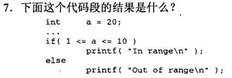 

   答：经典问题了。`1<=a`返回真，真即为 1，然后`1 <= 20`显然成立。

8. 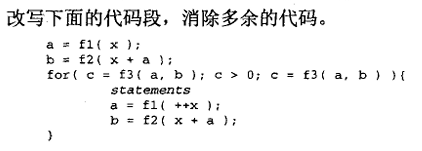 

   答：

   ```
   a = f1(x);
   b = f2(x + a);
   int c = f3(a, b);
   while (c > 0) {
       statements
       a = f1(++x);
       b = f2(x + a);
       c = f3(a, b);   // 更新条件
   }
   ```

9. 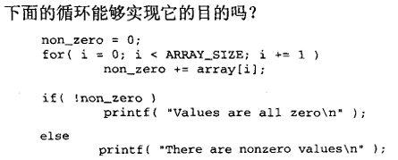 

   答：不能。如果数组中包含的非零值恰好和为零，则失败。

10. 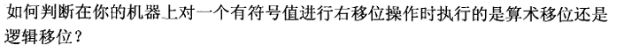 

    答：声明一个有符号整数，给它赋值，右移它一位，然后打印结果。如果为负，则使用算术移位；正表示逻辑移位。

------

## 编程题

1. 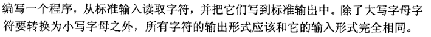 

   答：

   ```
   #include <stdio.h>
   
   int main() {
       int ch;
   
       // while ((ch = getchar()) != EOF)
       //   putchar(tolower(ch));
   
       while ((ch = getchar()) != EOF) {
           if (ch >= 'A' && ch <= 'Z')
               ch += 'a' - 'A';
           putchar(ch);
       }
   
       return 0;
   }
   ```

2. 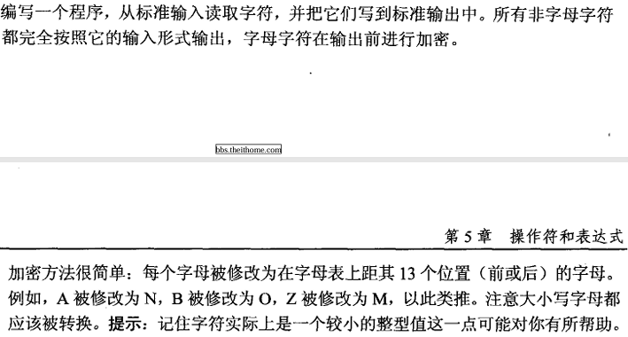 

   答：

   ```
   #include <stdio.h>
   
   int encrypt(int ch, int base) {
       ch -= base;
       ch += 13;
       ch %= 26;           // 处理溢出情况，很巧妙
       return ch + base;
   }
   
   int main() {
       int ch;
   
       while ((ch = getchar()) != EOF) {
           if (ch >= 'A' && ch <= 'Z')
               ch = encrypt(ch, 'A');
           else if (ch >= 'a' && ch <= 'z')
               ch = encrypt(ch, 'a');
           putchar(ch);
       }
   }
   ```

3. 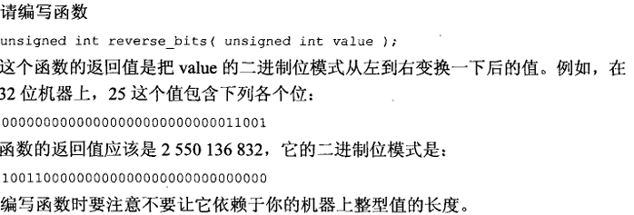 

   答：双指针扫一遍就行了。

   ```
   #include <stdio.h>
   
   int main() {
       int a = 25;
       unsigned int b = 0;
   
       for (int i = 0, j = 31; i <= 31; ++i, --j) {
           if (a & 1 << i)
               b |= 1 << j;
       }
       printf("%u\n", b);  // 2550136832
       return 0;
   }
   ```

4. 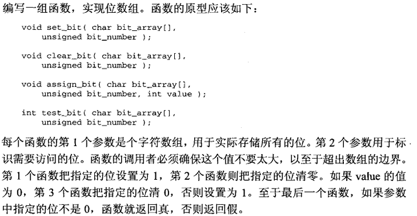 

   答：

   ```
   #include <limits.h>   /* CHAR_BIT */
   
   /* 把位号 bit_number 对应的位设为 1 */
   void set_bit(char bit_array[], unsigned bit_number)
   {
       unsigned idx = bit_number / CHAR_BIT;
       unsigned pos = bit_number % CHAR_BIT;
   
       bit_array[idx] |= (char)(1u << pos);
   }
   
   /* 把位号 bit_number 对应的位清 0 */
   void clear_bit(char bit_array[], unsigned bit_number)
   {
       unsigned idx = bit_number / CHAR_BIT;
       unsigned pos = bit_number % CHAR_BIT;
   
       bit_array[idx] &= (char)~(1u << pos);
   }
   
   /* 根据 value 的值设置或清除位：value==0 → 清0，非0 → 置1 */
   void assign_bit(char bit_array[], unsigned bit_number, int value)
   {
       if (value)
           set_bit(bit_array, bit_number);
       else
           clear_bit(bit_array, bit_number);
   }
   
   /* 测试位：非0返回1，0返回0 */
   int test_bit(char bit_array[], unsigned bit_number)
   {
       unsigned idx = bit_number / CHAR_BIT;
       unsigned pos = bit_number % CHAR_BIT;
   
       return (bit_array[idx] >> pos) & 1u;
   }
   ```

5. 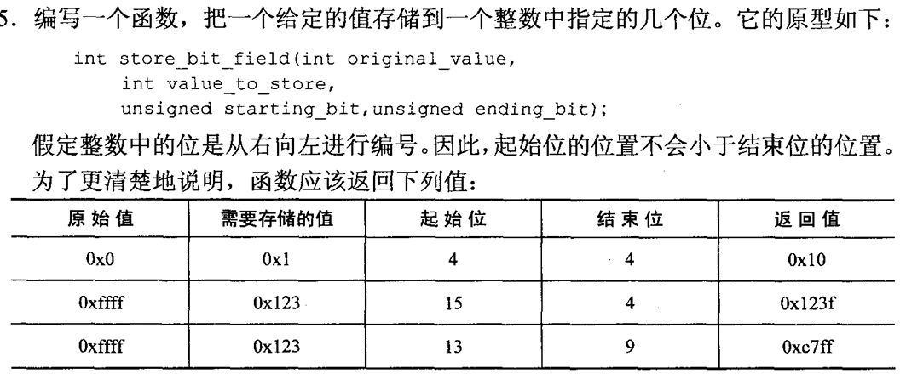 

   答：

   ```
   int store_bit_field(int original_value, int value_to_store, unsigned starting_bit, unsigned ending_bit) {
       unsigned int width = starting_bit - ending_bit + 1;
       unsigned int mask = (1 << width) - 1;
       unsigned int shifted_mask = mask << ending_bit;
       
       int cleared = original_value & ~shifted_mask;
       int adjusted_value = (value_to_store & mask) << ending_bit;
       int result = cleared | adjusted_value;
       
       return result;
   }
   ```

   


