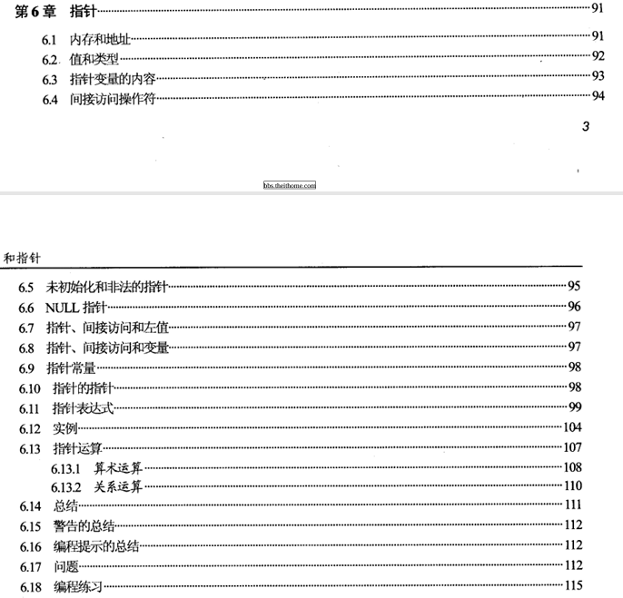
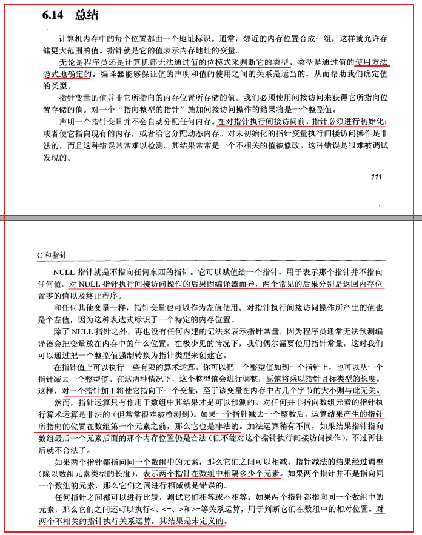
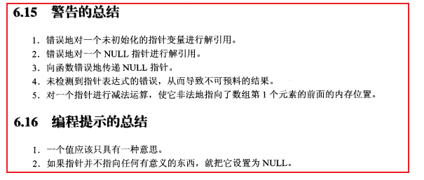
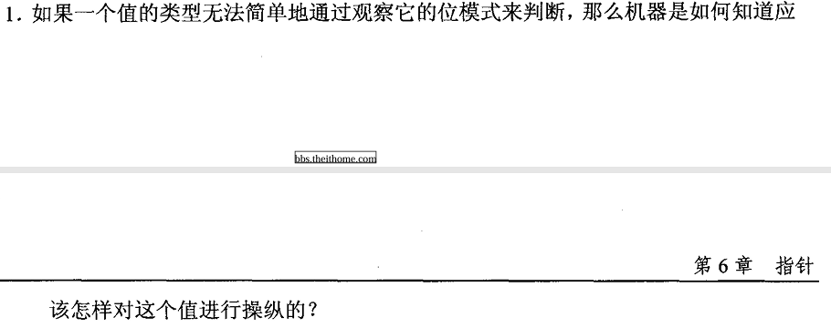
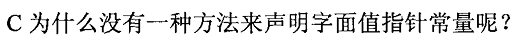
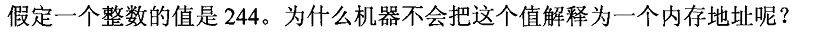
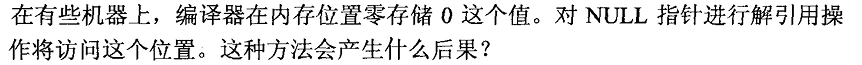
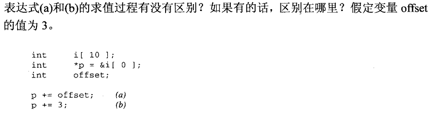
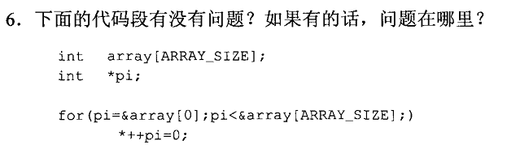
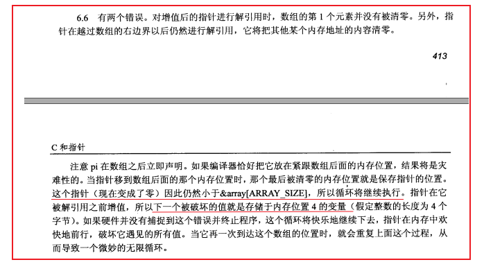

# **第六章 指针**

------

## **本章主要内容**

 

  

   

------

## 笔记

没啥好记的，C语言基础

------

## 课后习题答案

1. 

   答：通过中间编译器，编译器来判断，并创建合适的指令，机器来执行这些指令即可。

2.  

   答：内存无法提前预知，此操作意义非常之小，书上已经给了详尽说明。

3.  

   答：该值为一个整数，且没有取地址这个符号，则编译器就不生成对应指令，故无法将其解释为地址。

4.  

   答：书上讲了。因编译器而异，可能是 0，也能直接崩溃。一定要 **避免对空指针解引用**。

5.  

   答：感觉是没有的。**参考答案：** 即使 `offset` 的值与下一个表达式中的文本值相同，计算第一个表达式也要花费更多的时间，因为要将`offset`**缩放到整数必须在运行时完成**。这是因为变量可能包含任何值，而编译器无法提前知道实际值可能是什么。另一方面在编译时，字面值 3 可以通过在编译时乘以它来缩放为一个整数，结果这个乘法的值在运行时被简单地加到`p`上。换句话说，第二个表达式可以通过简单地将`12`加到`p`（在一台有四个字节整数的机器上）来实现；**无需运行时需要乘法。**。

   总结来看就是 **第一个操作，在运行期间才能完成，**而针对字面值常量的话，在编译期间就已经确定了，故在编译期间就能完成。其实就是指针偏移。

6.  

   答：两个错误。前置`++`导致数组第一个元素并没有被清 0，且最后会越过数组有边界并解引用将该块空间清 0。**还有一个内存连续导致的经典死循环问题，我没有考虑到**...详见参考答案：

    

   AI解释： 标准答案提到的“灾难性后果”是什么意思？

   如果`pi`这个指针变量恰好被编译器安排在数组`array`紧挨着的内存位置（这完全可能），那么：

   - 当`pi`越界后，它可能会把 **自己的值** 清零（设为0）。
   - 然后`pi`变成了 NULL，但循环条件`pi < &array[ARRAY_SIZE]`仍然成立（NULL 通常小于任何有效地址），于是循环继续。
   - 接下来，指针会继续向前移动，不断写 0，破坏内存中的其他变量，甚至进入死循环。

